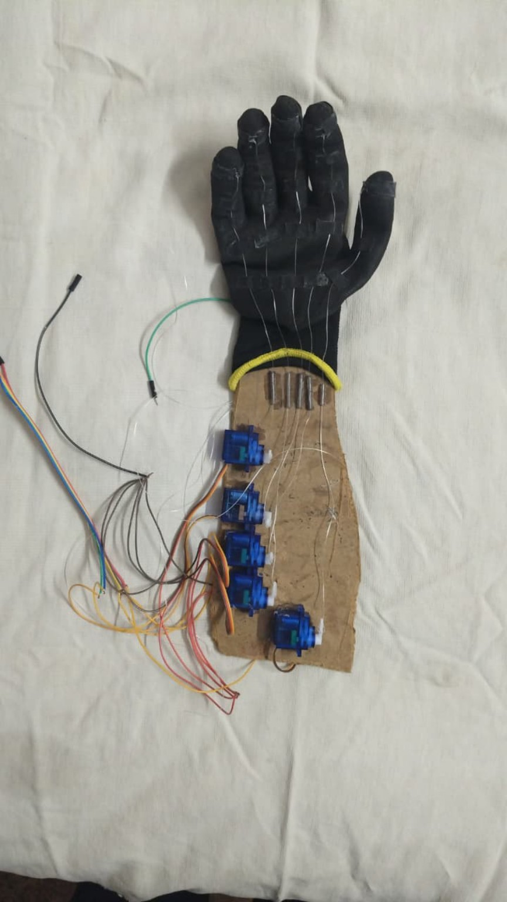

# Vision and Voice Controlled Assistive Robotic Arm

## Overview
This is a prototype assistive robotic arm system designed to help individuals with limited or no upper-limb mobility. The system combines computer vision, voice control, and embedded hardware to perform basic object detection and assisted grasping tasks.

The current implementation focuses on detecting objects (specifically bottles), confirming user intent via voice input, and executing predefined servo motion sequences to perform pick-and-place actions.

---

## Key Features

### 👁 Computer Vision (YOLO-based Detection)
- Uses a YOLO object detection model to identify target objects (e.g., bottles)
- Real-time detection using a camera feed

### 🎤 Voice-Control Interface
- Microphone-based command input
- Simple confirmation system ("yes" / "no") to trigger actions
- Reduces accidental actuation

### 🤖 Robotic Arm Control
- ESP32-based microcontroller handles servo actuation
- 5 servo motors control arm movement
- Motion is executed using predefined JSON-based motion sequences

### 🔁 Pick and Release Functionality
- "Grab" command executes stored motion to grasp object
- "Release" command returns arm to default position

---

## System Architecture

Camera → YOLO Model → Object Detection  
        ↓  
Voice Input (Microphone) → Command Confirmation  
        ↓  
Python Control Layer → JSON Motion Planner  
        ↓  
ESP32 → Servo Actuation (5 DOF Arm)

---

## Hardware Used
- ESP32 microcontroller  
- 5 Servo motors  
- USB Camera / Webcam  
- Microphone input device  
- Custom robotic arm structure  

---

## Current Limitations
- Movements are **predefined**, not dynamically generated
- No real-time inverse kinematics (IK) implementation yet
- Object types are limited (trained mainly for bottle detection)
- No adaptive learning from user behavior yet

---

## Future Scope (Important)
The long-term goal is to evolve this system into an intelligent assistive manipulation platform:

- Implementation of **Inverse Kinematics (IK)** for real-time adaptive movement
- Expansion from rigid motion scripts → dynamic trajectory generation
- Learning user behavior patterns over time
- Multi-object generalization beyond bottle detection
- Improved grasp stability using sensor feedback (force/pressure sensing)
- Lightweight on-device AI for embedded deployment

---

## Demo

---

## How It Works (Simplified)
1. Camera detects object using YOLO model
2. System prompts user for confirmation via voice
3. If user says "yes", ESP32 executes preloaded motion sequence
4. Arm performs grab action and waits for next command

---

## Why This Project Matters
This project explores a low-cost approach to assistive robotics using:
- Computer vision instead of expensive sensors
- Simple embedded control instead of industrial systems
- Modular architecture for future AI integration

It is an early-stage prototype of a potential assistive exoskeleton system.

---

## Author
Jhonathan.Punnish,Bhargav.
